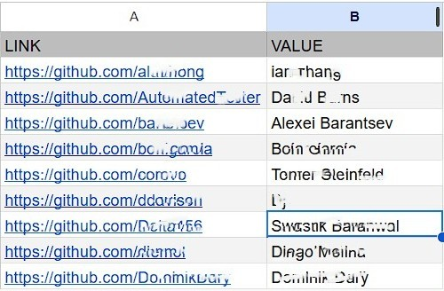

# 


## Table of Contents
- [Overview](#overview)
- [Installation](#installation)
- [Usage](#usage)
  - [Preparation Steps](#preparation-steps)
  - [Testing](#testing)
  - [Running](#running)
- [Project Structure](#project-structure)
- [License](#license)
- [Acknowledgements](#acknowledgements)
- [Credit](#credit)

## Overview

**WebSheetRunner** is a flexible automation framework that connects Google Sheets with websites. It reads URLs or data from Sheets, performs browser actions (like scraping or filling forms), and writes results back to the sheet — all customizable and POM-based.

#### Requirements:

- chromedriver: "^135.0.2",
- googleapis": "^148.0.0",
- webdriverio: "^8.44.1" (Note: higher versions are not compatible with chromedriver "^135.0.2")

#### Key Features:

- Read from any Google Sheet range
- Navigate and interact with websites using WebdriverIO
- Use Page Object Model (POM) architecture for clear structure
- Write results back to Sheets with ease
- Full async/await support for stable automation

## Installation

1. Clone this Repository:
   ```bash
   git clone https://github.com/yourusername/webdriverio-googlesheet.git
   ```

2. Navigate to the project directory:
   ```bash
   cd WebSheetRunner
   ```

3. Install dependencies:
   ```bash
   npm install
   ```

4. Add your `credentials.json` from Google Cloud to `/config/google`

5. Create a `.env`:
   ```env
   GOOGLE_CREDENTIALS=./config/credentials.json
   GOOGLE_SHEET_ID="-----ENTER SHEET ID-----"
   GOOGLE_SHEET_NAME="-----ENTER SHEET NAME-----"
   ```

## Usage

### Preparation Steps

1. Prepare columns in the Google Spreadsheet for reading and writing data. One column should store URLs or relevant data, while another (or others) should receive and record the written results back into the sheet.
   

2. Set your sheet ranges in `config/sheetRanges.js`
   ```js
     readCell: "A2",
     writeCell: "B2",
     readRange: "A2:A",
     writeStartCell: "B2",
   ```
   Or other ranges.

3. Set web selectors in `config/webSelectors.js`
   ```js
    github: {
    fullName: "h1.vcard-names span.p-name",
    bio: "div.p-note div",
    location: "span.p-label",
    website: "li[itemprop='url'] a",
    followers: "a[href$='followers'] span",
    following: "a[href$='following'] span",
    }
   ```
   Or other selectors.

4. Set the necessary selectors in the files `tests\sheetRunner.spec.js` and `tests\sheetRunner.spec.js` for working with the method:  
   ```js
    cellValue = await webPage.getValue(selectors.github.fullName);
   ```
   Or create own spec file.

### Testing:
You can test the functionality by running the file `tests\sheetTest.spec.js` using the command:
   ```bash
    npm run test
   ```
**Expected Outcome:**
- Connection to the credentials file will be validated.
- A single URL will be read from the designated column.
- The result will be written back to the column designated for receiving data.

**Console Logs:**
   * In case of an error:
   ```bash
    🔴 Error handling: [Error message]
   ```
   * When the URL is successfully retrieved:
   ```bash
    🟡 URL from [sheetRanges.readCell]: [URL or "Empty"]
   ``` 
   * Value obtained from the web page:
   ```bash
    🟢 Web Page value: [Value]
   ``` 
   * Successful write operation:
   ```bash
    ✅ [sheetRanges.writeCell] written
   ``` 

### Running
You can runn the file `tests\sheetRunner.spec.js` using the command:
   ```bash
    npm run parse
   ```
   If you have a custom file, use
   ```bash
    wdio run ./wdio.conf.js --spec ./tests/your-file.js
   ```
**Expected Result:** 
The Google Spreadsheet will be updated, with one column containing the retrieved URL or data and another storing the extracted results.

   


## Project Structure

```
/websheetrunner
│
├── config                     // Configuration files
│   ├── google                 // Stores Google API credentials
│   │   └── credentials.json   // JSON file with authentication credentials for Google API
│   ├── sheetRanges.js         // Defines cell ranges for reading and writing in Google Sheets
│   └── webSelectors.js        // Contains selectors for extracting data from web pages
│
├── node_modules               // Installed dependencies (auto-generated by npm)
│
├── pages                      // Page Object Model (POM) files
│   └── webPage.page.js        // Defines interactions with web pages (e.g., extracting data)
│
├── tests                      // Test scripts
│   ├── sheetRunner.spec.js    // Test for interacting with Google Sheets
│   └── sheetTest.spec.js      // Additional test file for sheet operations
│
├── services                   // Service layer for handling external API interactions
│   └── googleSheetService.js  // Manages Google Sheets API requests (reading/writing data)
│
├── .env                       // Contains environment variables, including path to Google credentials
├── package-lock.json          // Auto-generated file for dependency versions
├── package.json               // Defines project dependencies, scripts, and metadata
└── wdio.conf.js               // WebdriverIO configuration file for running tests
```

## Acknowledgements
Special thanks to:
* The Visual Studio team for their powerful development tools.
* The WebdriverIO community for providing excellent testing frameworks.
* Google for enabling seamless integration with Google Sheets API.
* The GitHub users whose profiles and repositories served as practical examples during implementation.


## Credits

  Created by gadiim.  
  Powered by WebdriverIO + Google Sheets API.
  The GitHub users referenced in this project were used solely for learning and demonstration purposes. 
  This project was developed as part of a personal learning exercise.


---

## ⚙️ Setup

1. Clone this Repository:
   ```bash
   git clone https://github.com/yourusername/WebSheetRunner.git
   cd WebSheetRunner
   ```
#### Navigate to the project directory:
2. Install dependencies:
   ```bash
   npm install
   ```

3. Add your `credentials.json` from Google Cloud to `/config` and create a `.env`:
   ```env
   GOOGLE_CREDENTIALS=./config/credentials.json
   ```

4. Set your sheet ID and ranges in `utils/sheetCells.js`

---

## ✅ Run Test

```bash
npx wdio run wdio.conf.js
```

---

## 🧪 Example

Reads GitHub profile URLs from column A and writes names to column B.

---

## 🔐 Permissions

Make sure your Google Sheet is shared with the email from your service account.

---

## 📄 License

MIT License.

---

## 🧠 Credits

Created with ❤️ by [Your Name].  
Powered by WebdriverIO + Google Sheets API.
